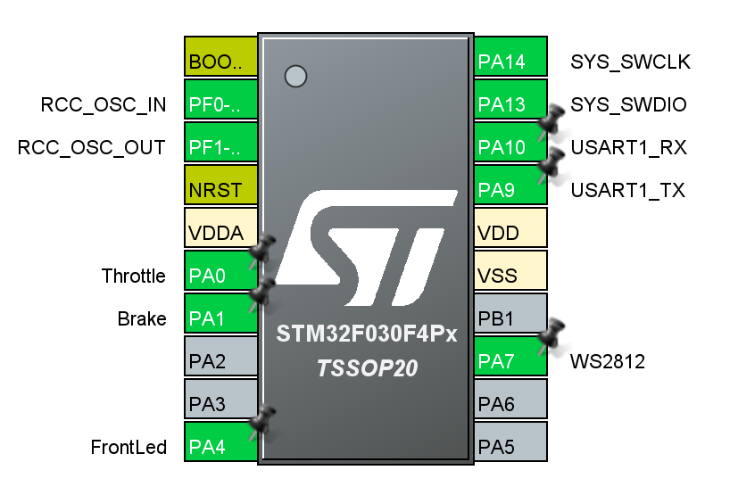
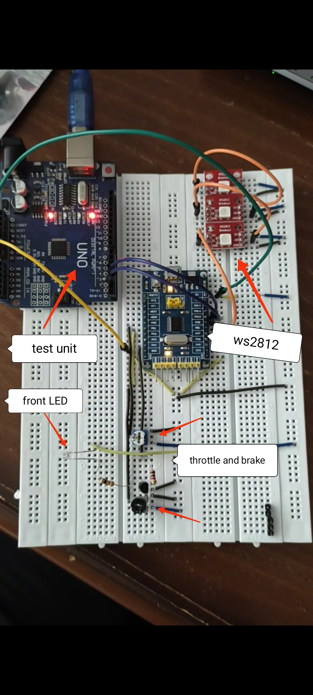

# overview

Features

- Non Stop (DMA + Interrupt)
- Easy API
- M0 MicroController (Low Power Usage)

# MicroController



# Config

## WS2812 Colors

```c
// Colors
#define APP_ColorOff (WS2812_colorStruct) {0, 0, 0}
#define APP_ColorLock (WS2812_colorStruct) {10, 0, 0}
#define APP_ColorFree (WS2812_colorStruct) {0, 10, 0}
#define APP_ColorFind (WS2812_colorStruct) {0, 0, 10}
```

## Brake

```c
// Brake
#define APP_BrakeFreeVoltage 50
```

## RX & TX Header

```c
#define APP_RXHeader '@'
#define APP_TXHeader '@'
```

## FrontLED Toggle Time

```c
#define APP_FrontLedToggleDelay 150
```

# API

Sending commands and receiving data

## Data Meaning

These Data used in RX & TX format
```c
// Lock States
#define APP_LockStateLock 0
#define APP_LockStateFree 1
#define APP_LockStateFind 2

// Front Led
#define APP_FrontLedOff 0
#define APP_FrontLedOn	1
#define APP_FrontLedToggle 2

// Brake
#define APP_BrakeFree 0
#define APP_BrakeTaken 1
```

## RX

```c
// ﹏﹏﹏﹏﹏﹏﹏﹏﹏﹏﹏﹏﹏﹏﹏﹏﹏﹏﹏﹏﹏﹏﹏﹏﹏﹏﹏﹏
// | RX Header(8bit) | 00 00 FrontLED(2) Lock(2) |
// ﹋﹋﹋﹋﹋﹋﹋﹋﹋﹋﹋﹋﹋﹋﹋﹋﹋﹋﹋﹋﹋﹋﹋﹋﹋﹋﹋﹋
```

## TX

```c
// ﹏﹏﹏﹏﹏﹏﹏﹏﹏﹏﹏﹏﹏﹏﹏﹏﹏﹏﹏﹏﹏﹏﹏﹏﹏﹏﹏﹏﹏﹏﹏﹏﹏﹏﹏
// | TX Header(8bit) | Throttle(8bit) | 00 00 00 Brake(1bit) |
// ﹋﹋﹋﹋﹋﹋﹋﹋﹋﹋﹋﹋﹋﹋﹋﹋﹋﹋﹋﹋﹋﹋﹋﹋﹋﹋﹋﹋﹋﹋﹋﹋﹋﹋﹋
```

# Test

Just connect Software Serial to the board and upload ArduinoTest code in it.
(just like Practice section)

# In Practice


